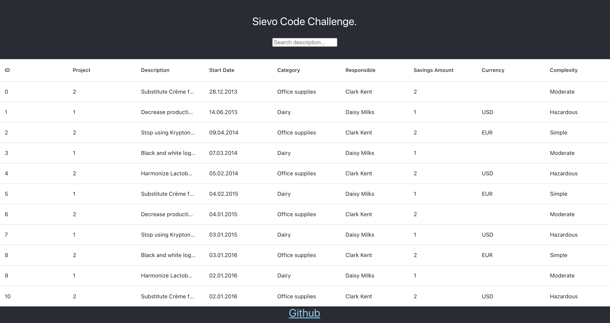

# Getting Started Sievo Code Challenge

## Available Scripts

In the project directory, you can run:

### `npm start`

Runs the app in the development mode.\
Open [http://localhost:3000](http://localhost:3000) to view it in the browser.

### `.Env Setup`

Create .env folder project root level. Then replace xxxx url
REACT_APP_API_WEBSITE_URL= https://XXXXXXXXXXXX/api/data

### Here Example
